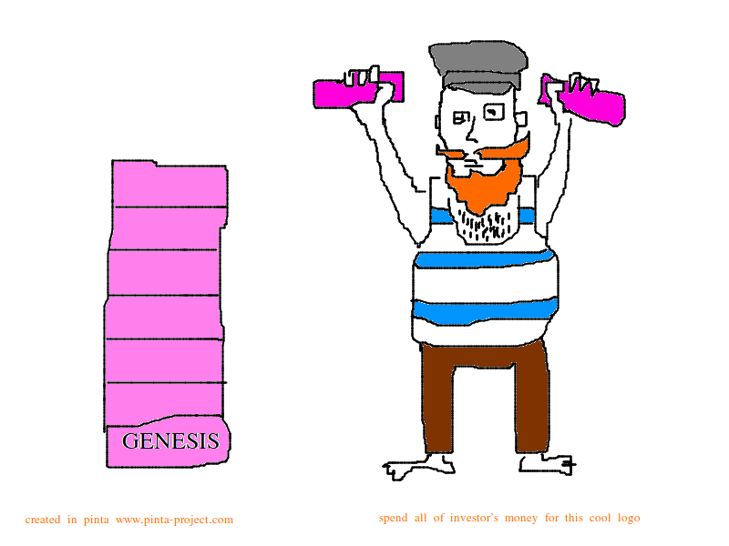

# boatswain

Learning blockchain technology project.



### Requirements

* Ubuntu 20.04
* Golang 16
* make

### Demo

```shell
make
./boatswain dapp chat

```

### Useful links

* https://ldej.nl/post/building-an-echo-application-with-libp2p/
