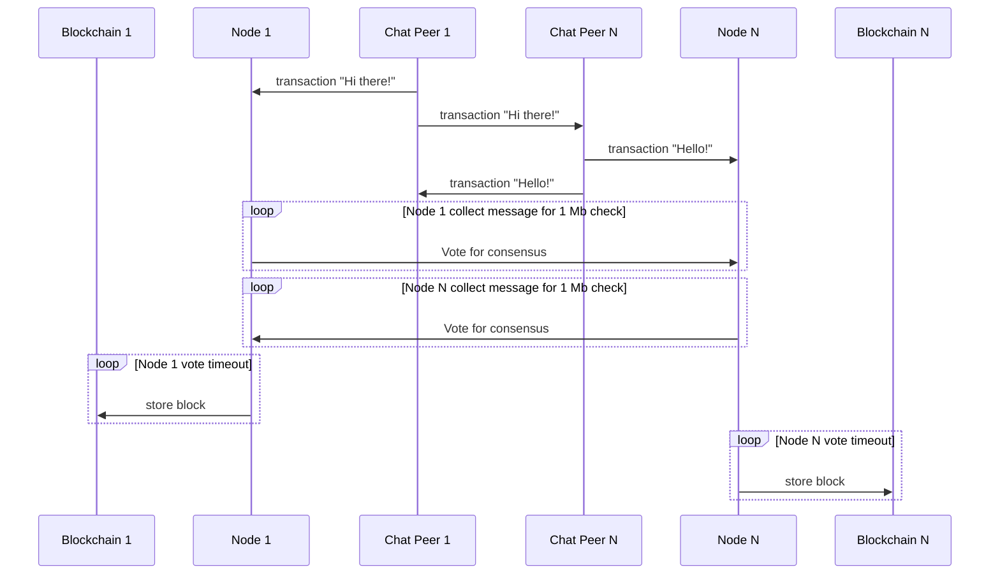

### Data flow

Node:

- <- "boatswain/transaction" topic
- <- "boatswain/consensus-vote" topic
- -> "boatswain/consensus-vote" topic
- -> "boatswain/reconciliation" topic

DApp Chat:

- <- "chat: <CHAT ID>" topic
- -> "chat: <CHAT ID>" topic
- -> "boatswain/transaction" topic
- <- "boatswain/reconciliation" topic

### Share new data inside topic "chat/cat-owners-worldwide"

```json
{
  "blockchain": "",
  "id": "<uuid>",
  "peer_sender": "peer-1",
  "peer_recipient": "",
  "content": "Hi there!",
  "timestamp": 1680950512
}
```

### Put transaction into node with "boatswain/transaction" topic

```json
{
  "blockchain": "chat/cat-owners-worldwide",
  "id": "uuid",
  "peer_sender": "peer-1",
  "peer_recipient": "",
  "content": "Hi there!",
  "timestamp": 1680950512
}
```

### Vote for consensus with "boatswain/consensus-vote" topic

```json
{
  "blockchain": "chat/cat-owners-worldwide",
  "index": 123456,
  "hash": "bbbbbbbbbbb",
  "previousHash": "aaaaaaaaaaa",
  "timestamp": 1680950612,
  "data": [
    {
      "id": "05d791bc-1846-407b-ae55-070266dad475",
      "peer_sender": "peer-1",
      "peer_recipient": "",
      "content": "Hi there!",
      "timestamp": 1680950512
    },
    {
      "id": "b2350be2-8270-494d-9eeb-2a5851c2fbed",
      "peer_sender": "peer-1",
      "peer_recipient": "",
      "content": "Where I can buy turkish angora in Europe?",
      "timestamp": 1680950523
    }
  ]
}
```

