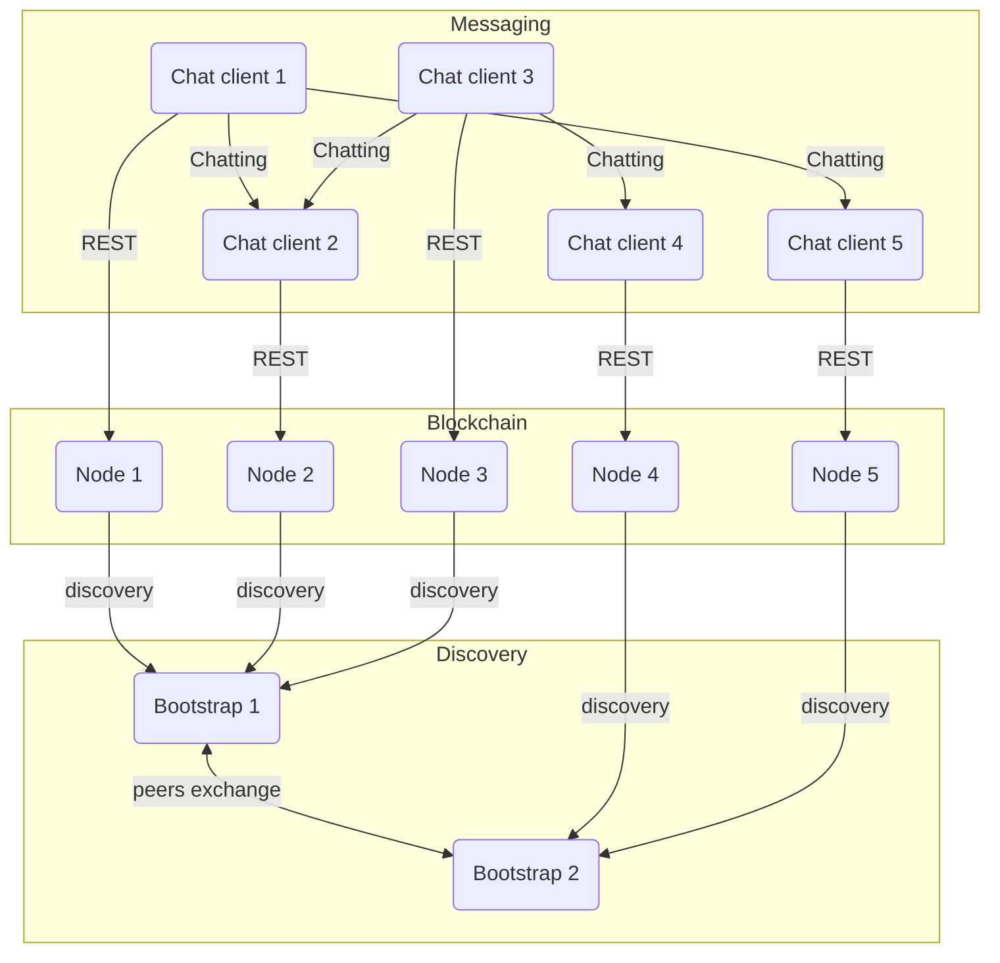
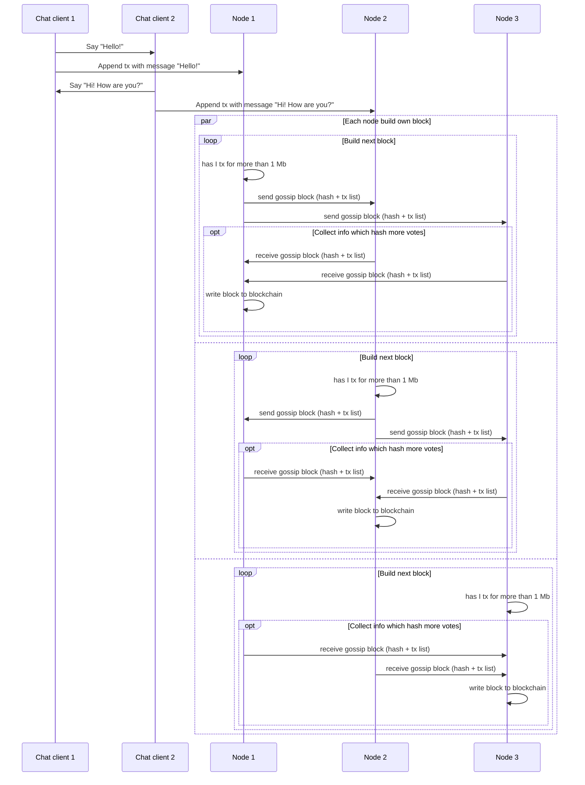

# Chat demo sample

### Connections diagram

```mermaid
flowchart TB
    subgraph Discovery
        B1(Bootstrap 1)
        B2(Bootstrap 2)
    end

    subgraph Blockchain
        N1(Node 1)
        N2(Node 2)
        N3(Node 3)
        N4(Node 4)
        N5(Node 5)
    end

    subgraph Messaging
        C1(Chat client 1)
        C2(Chat client 2)
        C3(Chat client 3)
        C4(Chat client 4)
        C5(Chat client 5)
    end

    B1 <-- peers exchange --> B2

    N1 -- discovery --> B1
    N2 -- discovery --> B1
    N3 -- discovery --> B1
    N4 -- discovery --> B2
    N5 -- discovery --> B2

    C1 -- REST --> N1
    C2 -- REST --> N2
    C3 -- REST --> N3
    C4 -- REST --> N4
    C5 -- REST --> N5

    C1 -- Chatting --> C5
    C1 -- Chatting --> C2
    C3 -- Chatting --> C4
    C3 -- Chatting --> C2
```

### Messaging way diagram

```mermaid
sequenceDiagram
    participant C1 as Chat client 1
    participant C2 as Chat client 2
    participant N1 as Node 1
    participant N2 as Node 2
    participant N3 as Node 3

    C1 ->> C2: Say "Hello!"
    C1 ->> N1: Append tx with message "Hello!"
    C2 ->> C1: Say "Hi! How are you?"
    C2 ->> N2: Append tx with message "Hi! How are you?"

    par Each node build own block
        loop Build next block
            N1 ->> N1: has I tx for more than 1 Mb
            N1 ->> N2: send gossip block (hash + tx list)
            N1 ->> N3: send gossip block (hash + tx list)

            opt Collect info which hash more votes
                N2 ->> N1: receive gossip block (hash + tx list)
                N3 ->> N1: receive gossip block (hash + tx list)
                
                N1 ->> N1: write block to blockchain
            end
        end
    and
        loop Build next block
            N2 ->> N2: has I tx for more than 1 Mb
            N2 ->> N1: send gossip block (hash + tx list)
            N2 ->> N3: send gossip block (hash + tx list)

            opt Collect info which hash more votes
                N1 ->> N2: receive gossip block (hash + tx list)
                N3 ->> N2: receive gossip block (hash + tx list)

                N2 ->> N2: write block to blockchain
            end
        end
    and
        loop Build next block
            N3 ->> N3: has I tx for more than 1 Mb

            opt Collect info which hash more votes
                N1 ->> N3: receive gossip block (hash + tx list)
                N2 ->> N3: receive gossip block (hash + tx list)

                N3 ->> N3: write block to blockchain
            end
        end
    end


```