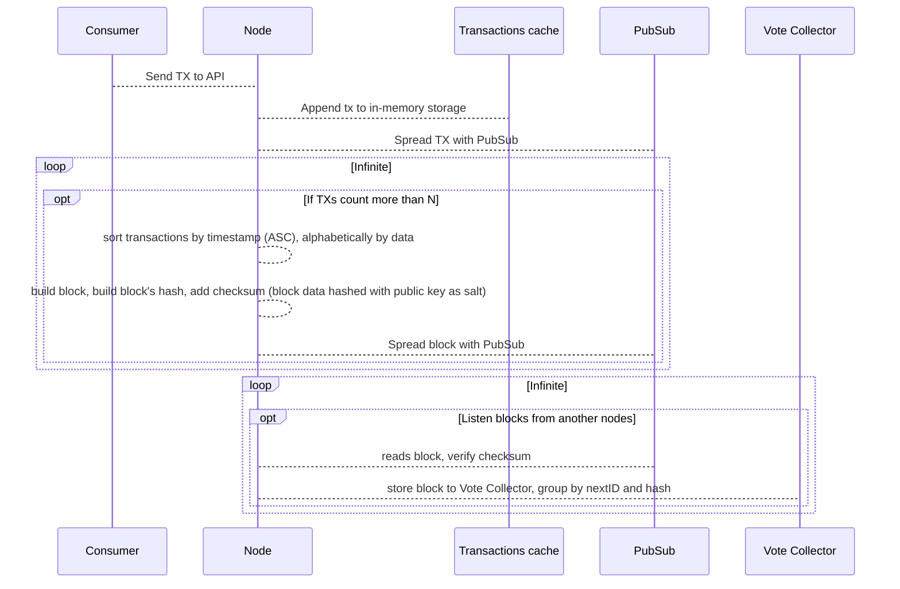

# Node

### Append data to blockchain

```mermaid
sequenceDiagram
    participant C as Consumer
    
    participant N as Node
    participant TXC as Transactions cache
    participant PS as PubSub
    participant VC as Vote Collector
    
    C --> N: Send TX to API
    N --> TXC: Append tx to in-memory storage
    N --> PS: Spread TX with PubSub
    
    loop Infinite 
        opt If TXs count more than N
            N --> N: sort transactions by timestamp (ASC), alphabetically by data
            N --> N: build block, build block's hash, add checksum (block data hashed with public key as salt)

            N --> PS: Spread block with PubSub
        end
    end
    
    loop Infinite 
        opt Listen blocks from another nodes
            PS --> N: reads block, verify checksum
            N --> VC: store block to Vote Collector, group by nextID and hash
        end
    end
```
